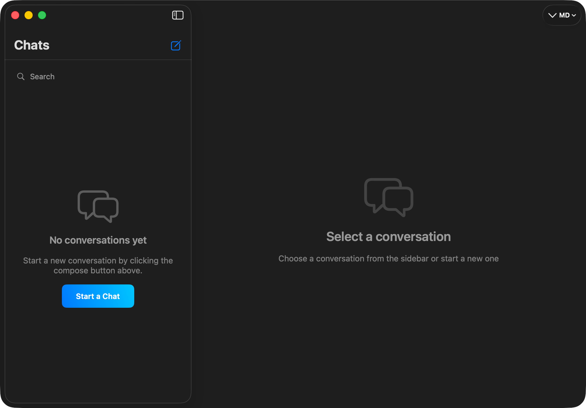

# XDchat

[](LICENSE)
[](https://www.apple.com/macos/)
[](https://swift.org)

Native macOS chat application built with SwiftUI and Firebase.

## Features

- Real-time messaging with text, GIFs, stickers, and emoji
- User authentication with invitation system
- Dark/Light mode with Messenger-inspired design
- Admin controls for user management
- Typing indicators and online status
- Auto-updates via Sparkle

## Screenshot

<p align="center">
  
</p>

## Requirements

- macOS 15.0+ (Sequoia)
- Xcode 16.0+
- Swift 5.9+
- Firebase account
- Giphy API key

## Getting Started

### 1. Clone the Repository

```bash
git clone https://github.com/dembsky/XDchat.git
cd XDchat
```

### 2. Configure API Keys

Copy the example config and fill in your values:

```bash
cp Config.xcconfig.example Config.xcconfig
```

Edit `Config.xcconfig` and set your Giphy API key:

```
GIPHY_API_KEY = your_giphy_api_key_here
```

Get a free API key at [developers.giphy.com](https://developers.giphy.com).

### 3. Configure Firebase

1. Go to [Firebase Console](https://console.firebase.google.com)
2. Create a new project
3. Add a macOS app with your bundle identifier
4. Download `GoogleService-Info.plist`
5. Place it in `XDchat/Resources/`

#### Enable Firebase Services

In Firebase Console:

**Authentication:**
- Go to Authentication > Sign-in method
- Enable **Email/Password**

**Firestore Database:**
- Go to Firestore Database > Create Database
- Start in **production mode**

**Firestore Security Rules:**

Deploy the included rules:

```bash
npm install -g firebase-tools
firebase login
firebase init firestore  # select your project
firebase deploy --only firestore:rules
```

Or copy the rules from `firestore.rules` into the Firebase Console manually.

### 4. Open in Xcode

```bash
open XDchat.xcodeproj
```

Xcode will automatically resolve Swift Package dependencies (Firebase, SDWebImageSwiftUI, Sparkle).

### 5. Build and Run

1. Select your Mac as the run destination
2. Press **Cmd+R**

### First Run

1. **First user = Admin**: The first user to register becomes the admin
2. Register without an invitation code (only for the first user)
3. As admin, you can generate invitation codes for other users

## Project Structure

```
XDchat/
├── XDchatApp.swift           # App entry point
├── Models/                    # Data models
│   ├── User.swift
│   ├── Message.swift
│   ├── Conversation.swift
│   └── Invitation.swift
├── Views/                     # SwiftUI views
│   ├── MainView.swift
│   ├── Auth/
│   ├── Conversations/
│   ├── Chat/
│   └── Admin/
├── ViewModels/               # View models (MVVM)
│   ├── AuthViewModel.swift
│   ├── ConversationsViewModel.swift
│   ├── ChatViewModel.swift
│   └── InvitationViewModel.swift
├── Services/                 # Backend services
│   ├── AuthService.swift
│   ├── FirestoreService.swift
│   ├── GiphyService.swift
│   └── InvitationService.swift
├── Utilities/                # Helpers
│   ├── Theme.swift
│   ├── Extensions.swift
│   └── Constants.swift
└── Resources/
    ├── Assets.xcassets/
    ├── Info.plist
    └── Entitlements.entitlements
```

## Architecture

- **MVVM Pattern** - ViewModels manage state and business logic
- **Services Layer** - Singleton services handle Firebase and API communication
- **Real-time Updates** - Firestore listeners for live data sync
- **Theme System** - Adaptive colors for Dark/Light mode

## Distribution & Auto-Updates

XDchat uses [Sparkle](https://sparkle-project.org/) for auto-updates outside the App Store.

If you fork this project for your own distribution:

1. Generate your own Sparkle EdDSA key pair:
   ```bash
   ./build/SourcePackages/artifacts/sparkle/Sparkle/bin/generate_keys
   ```
2. Update `SUPublicEDKey` in `Info.plist` with your public key
3. Update `SUFeedURL` in `Info.plist` to point to your own appcast
4. Update `PRODUCT_BUNDLE_IDENTIFIER` to your own bundle ID
5. Sign with your own Developer ID for notarized distribution

## Build for Distribution

To build a signed and notarized release:

```bash
export TEAM_ID="your_team_id"
export DEVELOPER_ID="Developer ID Application: Your Name (TEAM_ID)"
export APPLE_ID="your_apple_id@example.com"
export APP_SPECIFIC_PASSWORD="your_app_specific_password"

./scripts/build-release.sh
```

## Contributing

See [CONTRIBUTING.md](CONTRIBUTING.md) for guidelines.

## Troubleshooting

### Firebase not configured
Make sure `GoogleService-Info.plist` is in `XDchat/Resources/` and contains valid credentials.

### GIFs not loading
Check that your Giphy API key is set in `Config.xcconfig`.

### Authentication errors
Verify that Email/Password authentication is enabled in Firebase Console.

### Build errors with dependencies
Try: File > Packages > Reset Package Caches in Xcode.

## License

This project is licensed under the MIT License - see [LICENSE](LICENSE) for details.
